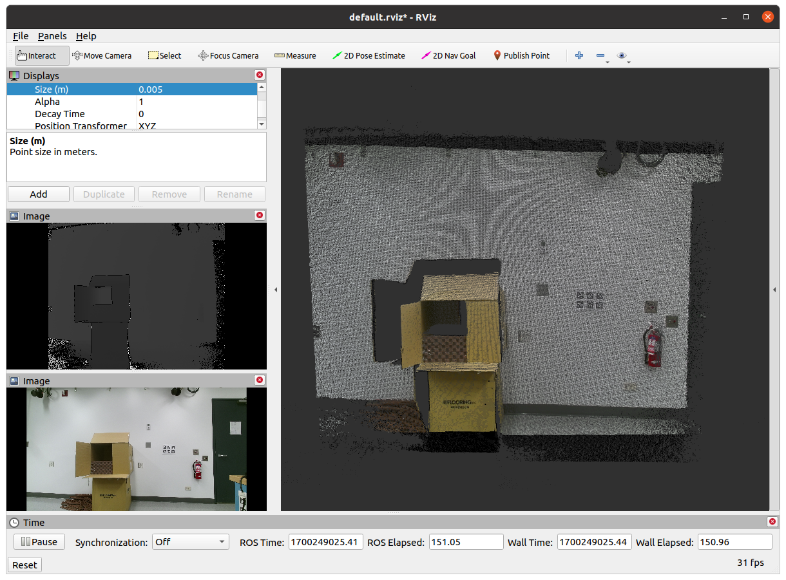

# Dockerized IAI Kinect2
This repository is a dockerized CPU version of the original reference repository [here](https://github.com/code-iai/iai_kinect2). The idea is to simplify the usage through a docker image with minimal system dependent optional flags (e.g. CUDA ...). Simply make the image, run it, and subscribe to the topics within your local ROS system. 

## Make The Image
Simply clone the repository and run the following within its root directory:

```bash
docker build -t <image_name:image_tag> .  
``` 
Then run the container through the following. The `--net=host` and `--ipc=host` are set for seamless connection between the ROS on the host and in the container while `--privileged` has been set to allow hardware access to the Kinect. 

```bash
docker run --privileged -it --net=host --ipc=host --shm-size=1gb <image_name:image_tag> 
```
Then, you can visualize the pointcloud, depth, and RGB data through rivz running on the host computer:

